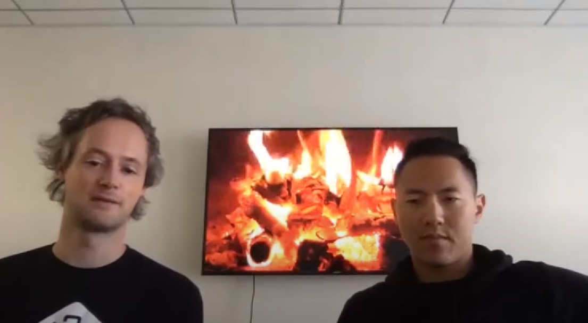

# OHwA S03E04

For episode four of the season, Arbitrage wanted to discuss the previous day's [Q4 fireside chat](https://www.youtube.com/watch?v=mbwMXUzPot4&feature=youtu.be) with [Richard Craib](https://twitter.com/richardcraib) and [Anson Chu](https://twitter.com/ansonschu).

The full discussion of the fireside chat will be available on the [Numerai YouTube channel](https://youtube.com/numerai).

### Fireside chat takeaways

**Additional model spots announced**

During the fireside chat, Slyfox said they intended to add support for additional model spots potentially within one day, but he explained that it was more complex than they initially suspected. "I wanted to do more checks," he told Arbitrage, "we've really stepped up our game for not shipping features that are broken on the first day and I don't want to be the one to break that trend."

**Levered MMC**

Arbitrage pointed out that if tournament competitors can't change their stakes fast enough, the alternative would be to apply leverage on correlation or corr + MMC. "A smaller stake but at 2x might help," Arbitrage said. He brought up levered MMC because he wanted to know which would happen first: access to leverage or the ability to change stakes faster.

Slyfox said that currently, shipping Nomi is the highest priority and he wants to include a feature alongside the new target. The MMC multiplier is easier for the team to build than changes to the staking mechanisms or withdrawal process. "I've been working on changing stakes for a long time," Slyfox said, "but there are a **lot** of corner cases and I don't want to rush that feature."

**Michael Oliver: analyzing models trained on Nomi**

[Michael Oliver](https://numer.ai/mdo) explained that he made a simple, naïve meta-model made up of Nomi-trained models users submitted to him, and stake-weighted version of the naïve meta-model, both of which showed early signs of positive performance. 

**If Validation 2 includes data after the test set, is it possible there’s a data leak now that people may be training on Validation 2?**

Arbitrage explained that because Validation 2 occurs during the COVID timeframe, if some models are training on Validation 2, competitors are getting a time leak if the test set is before COVID. 

Michael Oliver said that there's no data leak in the sense that there's no overlapping periods of time between the test set and Validation 2.  "The big jumps in performance we've seen recently seem to correspond with the release of the \[diagnostic\] metrics and Nomi," Michael Oliver said.

**If your correlation goes down from Kazutsugi to Nomi on some models, what would be the reason? Is it feature exposure or some other reason?**

Michael Oliver explained that it's hard to say exactly, "there are a million and one reasons why performance might go up or down," he said. He added that Nomi is a slightly more difficult target, saying that Kazutsugi has more regularization with uniform distributions built in so correlation is a little easier to achieve on those targets.  

**Validation data: obscured weeks present on the metrics page**

The idea would be to obscure the live data, but show competitors model performance over the previous three weeks. Slyfox said that he thinks it's a good idea because it would give data scientists a better idea of what it would look like to compete live. It would also allow the team to compute more realistic expected returns metrics. 

**Michael Oliver: can you explain the feature neutralization function you recently posted about?**

Michael Oliver explained that feature neutralization is essentially finding a linear model in terms of the features of a model's predictions and then subtracting that off in some proportion. The function is trying to find a linear model that, when subtracted off, lower's the model's feature exposures below a threshold. Data scientists can set a target feature exposure value, e.g. 10%, and the code tries to find a model to subtract that brings the feature exposure for each feature down below the set threshold.

_If you’re passionate about finance, machine learning, or data science and you’re not competing in_[ _the most challenging data science tournament in the world_](https://numer.ai/tournament)_, what are you waiting for?  
  
Don’t miss the next Office Hours with Arbitrage : follow_[ _Numerai on Twitter_](http://twitter.com/numerai) _or join the discussion on_[ _Rocket.Chat_](https://community.numer.ai/home) _for the next time and date.   
  
Thank you to_ [_Michael Oliver_](https://numer.ai/mdo) _for talking about Nomi \(again again\), to_ [_Wigglemuse_](https://numer.ai/wigglemuse) _and_ [_JRB_ ](https://numer.ai/jrb)_for contributing to this week's discussion,_ _and to_ [_Arbitrage_](https://numer.ai/arbitrage) _for hosting._

